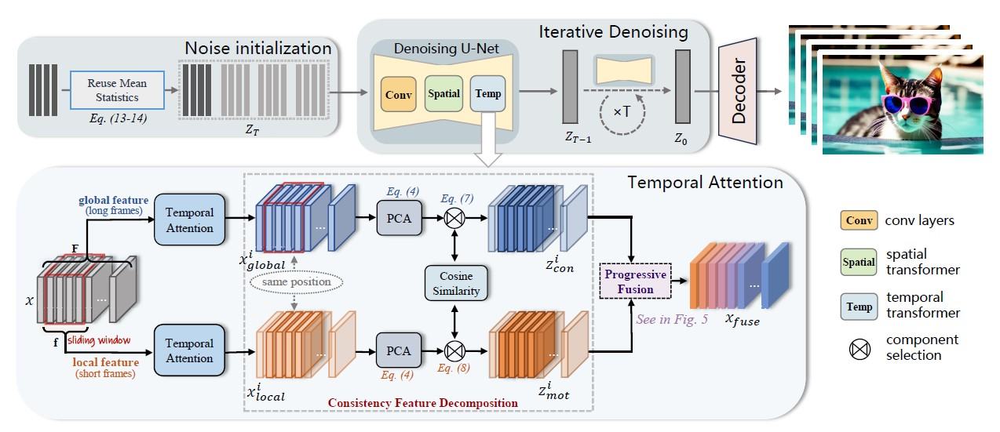

# FreePCA：Integrating Consistency Information across Long-short Frames in Training-free Long Video Generation via Principal Component Analysis

## Overview


## Setup (based on [Videocrafter2](https://github.com/AILab-CVC/VideoCrafter/tree/main))

### 1. Install Environment via Anaconda (Recommended)
```bash
conda create -n freepca python=3.8.5
conda activate freepca
pip install -r requirements.txt
```

### 2. Download pretrained T2V models via [Hugging Face](https://huggingface.co/VideoCrafter/VideoCrafter2/blob/main/model.ckpt), and put the `model.ckpt` in `checkpoints/base_512_v2/model.ckpt`.

### 3. Input the following commands in terminal.
```bash
  sh scripts/run_text2video.sh
```
